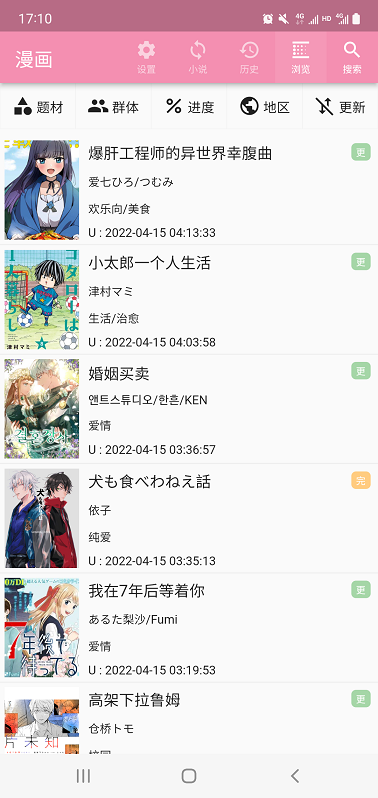
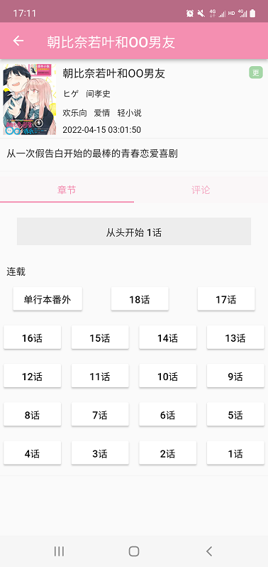

daisy
=====

一个简洁大方的漫画与轻小说客户端, 同时支持支持 Android / iOS / MacOS / Windows / Linux.

此APP含有"吸烟/饮酒/斗殴/言情/两性"等内容或间接性描述, 因此限制级别为"R12+PG14"，建议在12岁以上才能使用, 14岁以下的用户在监护人陪同下使用，并请在使用过程中遵守当地法律法规。

如果您觉得此软件对您有帮助，可以star进行支持。同时欢迎您issue，一起让软件变得更好。

仓库地址 https://github.com/niuhuan/daisy

## 软件截图

## 技术架构

客户端使用前后端分离架构, flutter作为渲染框架. rust作为底层调度网络和文件系统. Flutter与rust均为跨平台编程语言, 以此支持 android/iOS/windows/macOS 等不同操作系统.

### 如何构建

1. 安装flutter, rust-lang
2. 安装相应平台SDK  
  1). cmake, ninja, pkg-config等开发工具 （windows/linux） 
  2). 安装 xcode（macOS/iOS/）  
  3). android studio, android SDK 等开发工具 (android)  
3. 安装`flutter_rust_bridge` 运行 `cargo install flutter_rust_bridge`  
4. `flutter run`

### 如何开发调试

阅读flutter_rust_bridge的文档, 了解如何在flutter中调用rust代码.
